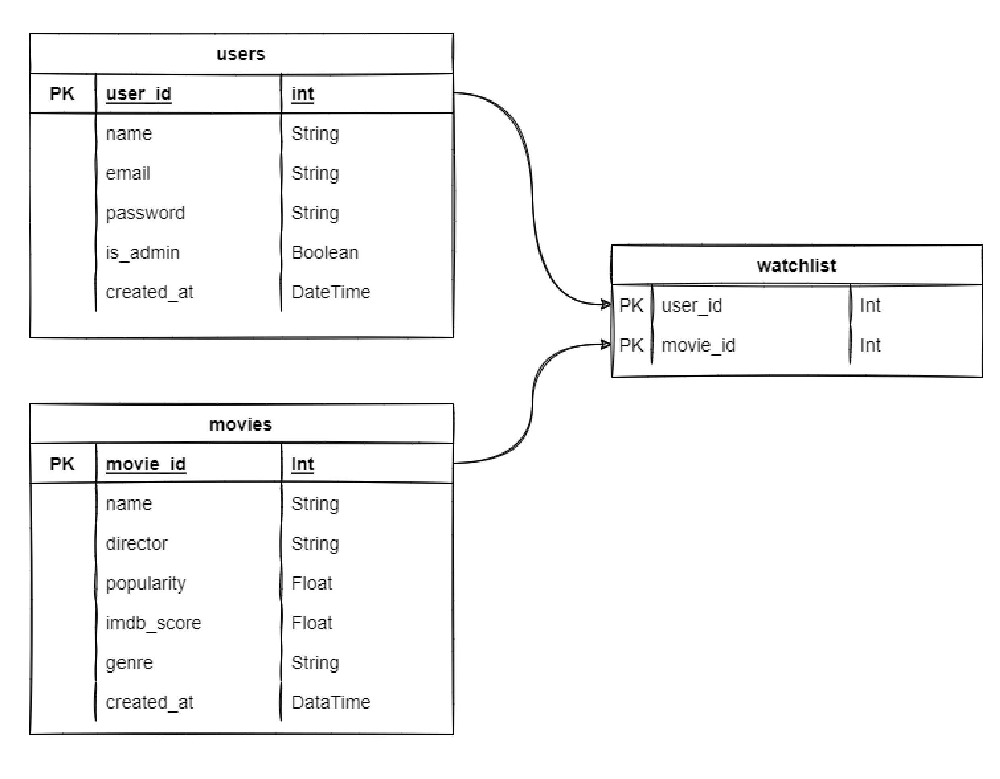

# IMDB Clone

This Application is developed with python's web framework FastAPI. \
Project is deployed at [https://imdbrestbackend.herokuapp.com/](https://imdbrestbackend.herokuapp.com/docs) using Heroku

### Project Requirements:
- Python 3.10.1
- MySQL/PosgreSQL

### Steps for setting up the project in local

1. Clone GitHub Repo: [https://github.com/MKoriya/imdb_clone.git](https://github.com/MKoriya/imdb_clone.git)
2. Create Virtual Env: ` python -m venv venv `
3. Activate venv: `source venv/bin/activate`(Linux) and `venv\Scripts\activate`(Windows)
4. Go Inside Project Folder: `cd imdb_clone`
5. Download dependencies: `pip install -r requirements.txt`
6. Create `.env` file with following keys:
```bash
SQL_DATABASE_URL='your database url'
JWT_SECRET_KEY='secret key for JWT can be any random string'
JWT_ALGORITHM='algorithm for web token'
JWT_EXPIRATION_TIME='expiration time in days'
```
7. Run project: `uvicorn app.main:app --reload` 
8. App will start on you local: [`http://127.0.0.1:8000/`](http://127.0.0.1:8000/)


### Database Design



### Access Level
1. Admin access: can create, edit and delete users, admin users and movies
2. User access: can create, update and retrieve watchlist, create, edit and delete their own user 
3. Public[No Auth required] access: can search movies

### API Docs
You can access interactive API documentation auto built by FastAPI using Swagger UI [here](https://imdbrestbackend.herokuapp.com/docs)

### Testing
You can test all the APIs using Postman or interactive API docs at [here](https://imdbrestbackend.herokuapp.com/docs).\
You can use following credentials for testing: \
Admin:
```
username: "admin@gmail.com"
password: "root"
```

### Note
Due to limitation of Heroku we won't be able to run test cases on server as it only allows one database per application. so to run test cases you can clone repository and run command `pytest` from root directory. 


##
## End Points
### Login URL
[docs](https://imdbrestbackend.herokuapp.com/docs#/Authentication%20APIs)
```
POST    /api/v1/auth/login/
to login

Authentication: Public

Request Data:
{
    username: EmailStr
    password: str
}

Errors:
403 Invalid Credentials

Response:
{
    access_token: str
    token_type: "Bearer"
}
```


### User 
[docs](https://imdbrestbackend.herokuapp.com/docs#/User%20APIs)
```
GET   /api/v1/user/{user_id}/ 
To get the user data can be access by admin and user himself

Authentication: User Level, Admin Level

Errors: 
401 Not Authorized
404 If User ID does not exists

Response:
{
user_id: int
name: str
email: EmailStr
is_admin: bool 
}
```
```
POST   /api/v1/user/create/ 
to create user

Request Data:
{
name: str
email: EmailStr
password: str
}

Authentication: Public Level

Errors: 
400 Email Already in Use
422 Invalid Request data

Response: 201
```
```
POST   /api/v1/user/create/admin/
to create admin user

Request Data:
{
name: str
email: EmailStr
password: str
}

Authentication: Admin Level

Errors: 
422 Invalid User Data
400 Email Already in Use
401 Not Authorized

Response: 201
```
```
DELETE   /api/v1/user/delete/{user_id}/ 
To delete user, can be access by admin and user himself

Authentication: User Level, Admin Level

Errors: 
401 Not Authorized
404 If User ID does not exists

Response: 204
```
```
PUT   /api/v1/user/change_password/ 
To change user password, can be access by user logged in user only

Request Data:
{
   old_password: str,
   new_password: str
}

Authentication: User Level

Errors: 
400 wrong old password
401 Not Authorized

Response: 204
```

### Movie
[docs](https://imdbrestbackend.herokuapp.com/docs#/Movie%20APIs)
```
GET   /api/v1/movie/list/
To get the list of all the movies

Query Params:
limit: int -> to limit the number of return value (default=10)
skip: int -> to skip initial return value (default=0)
search: str -> search movies by name 

Authentication: Public Level

Errors:
400 Bad Request

Response:
[{
    movie_id: int
    name: str 
    director: str
    popularity: float
    imdb_score: float
    genre: str
}]
```
```
GET   /api/v1/movie/{movie_id}/
To get specific movie with Id

Authentication: Public Level

Errors:
400 Bad Request
404 No Movie with request movie_id

Response:
{
    movie_id: int
    name: str 
    director: str
    popularity: float
    imdb_score: float
    genre: str
}
```
```
POST   /api/v1/movie/create/
To create movie

Authentication: Admin Level

Request Data:
{
    name: str
    director: str
    popularity: float
    imdb_score: Optional[float] (default=0)
    genre: str
}

Errors:
400 Movie already exists
401 Not Authorized
422 Invalid request data

Response: 201
```
```
PUT   /api/v1/movie/update/{movie_id}/
To update movie values

Authentication: Admin Level

Request Data:
{
    name: str
    director: str
    popularity: float
    imdb_score: Optional[float] (default=0)
    genre: str
}

Errors:
401 Not Authorized
404 No Movie with request movie_id

Response:
{
    movie_id: int
    name: str 
    director: str
    popularity: float
    imdb_score: float
    genre: str
}
```
```
DELETE   /api/v1/movie/delete/{movie_id}/
To update movie values

Authentication: Admin Level

Errors:
401 Not Authorized
404 No Movie with request movie_id

Response: 204
```

### Watchlist
[docs](https://imdbrestbackend.herokuapp.com/docs#/Watch%20List%20APIs)
```
GET    /api/v1/watchlist/show/
User can get their watchlist

Authentication: User Level

Errors:
401 Not Authorized

Resonse:
[{
    movie_id: int
    name: str
}]
```
```
POST    /api/v1/watchlist/add/
User can add movie into their watchlist

Authentication: User Level

Request Data:
{
    movie_id: int
}

Errors:
401 Not Authorized
422 Invalid request data
404 wrong movie id
400 movie already in watchlist

Resonse: 201
```
```
DELETE    /api/v1/watchlist/remove/
User can remove movie from their watchlist

Authentication: User Level

Request Data:
{
    movie_id: int
}

Errors:
401 Not Authorized
422 Invalid request data
404 movie does not exists in watchlist

Resonse: 204
```